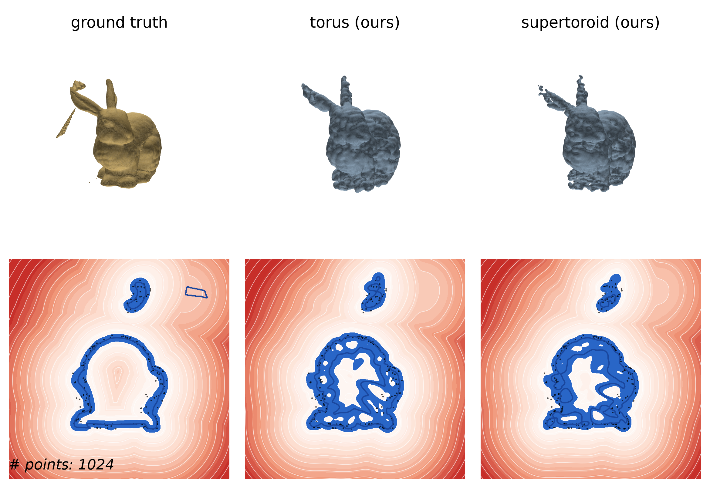

# Points as (Super)Tori

A from-scratch Python reimplementation of

> **Points as Tori: Fast Pointwise Signed Distance for Point Clouds**
> Nicole Feng, Ioannis Gkioulekas, Keenan Crane — ACM TOG 2026
> (inspired by <https://nzfeng.github.io/research/PointsAsTori/index.html>)

…**extended from tori to supertoroids**, with unit tests, a
[polyscope](https://polyscope.run) (Nicholas Sharp / "nmwsharp") visual demo, and a
self-contained PyTorch training notebook for Google Colab.

---

## Gallery — torus (based on Feng 26) vs supertoroid (ours)

Each figure follows the paper's comparison layout — **top:** ground-truth surface and the two
reconstructions (marching cubes of the blended SDF); **bottom:** a slice of the signed-distance
field with red distance isolines, the zero level set in blue, and the input point cloud as black
dots. Reconstructions use the GPU-trained networks (`assets/pat_torus.pt`,
`assets/pat_supertoroid.pt`).

| Stanford bunny (complex asset) | Hole + bolts plate |
|:---:|:---:|
|  |  |

| Cube + cylinder, sampled **with noise** | Sharp corners & **textures** (diamond knurl) |
|:---:|:---:|
|  |  |

Regenerate with `python make_renders.py` (uses the trained checkpoints in `assets/` if present).

---

## What the method does

Given a point cloud `P` with normals, *Points as Tori* (PAT) produces an **analytic,
pointwise signed-distance function** to the underlying surface — no global solve, no
spatial grid — by:

1. **Fitting one torus per point** (precompute). A torus has a closed-form SDF and can
   locally match any second-order surface (sphere, ellipsoid, saddle, cylinder, plane as
   limits). The torus is determined from six polynomial coefficients of the local height
   function via Monge-patch curvatures (paper Sec. 4.1 + Appendix C).
2. **Blending** the per-point signed torus functions with a self-normalized,
   exponentially-weighted average (Eq. 1 / Eq. 25), with the screening parameter
   `λ` chosen automatically per query from machine precision (Eq. 26):

   ```
   φ(x) = Σ_i g_i(x) e^(−λ_x(‖x−p_i‖−σ_x))  /  Σ_i e^(−λ_x(‖x−p_i‖−σ_x))
   ```

The six coefficients are produced either by **least squares** (training-free, the default
— works great on clean data, brittle on curved/real data exactly as the paper's Fig. 3
shows) or by a small **Transformer** trained once and reused across shapes (Sec. 4.3).

### The supertoroid extension (this repo's addition)

The paper uses ordinary tori, whose ring and tube cross-sections are **circles**. We
generalize each cross-section to an **L^p super-ellipse** with two squareness exponents
`p_tube`, `p_ring`:

```
ring_radius = ‖(a, b)‖_{p_ring}        # super-ellipse in the plane ⟂ axis
φ_super(x)  = ‖(ring_radius − R, axial)‖_{p_tube} − r
```

* `p = 2` reproduces the paper's torus **exactly** — the torus is a strict special case,
  so a trained torus model is contained in the supertoroid model.
* `p > 2` gives boxy, rounded-square cross-sections that an ordinary torus cannot
  represent. These help on shapes with flat faces / boxy edges, where a circular tube
  cannot sit flush.

This is an *approximate* radial SDF for `p ≠ 2` (exact at `p = 2`), which is all the
blending framework — itself an approximation — needs. It is fully differentiable, so the
squareness can be learned/optimized alongside the coefficients.

---

## Repository layout

```
pat/
  core.py        differentiable torus & supertoroid SDFs, coeff→params fit, blending (Eq. 23–26)
  shapes.py      analytic SDF primitives + samplers (exact ground truth): Sphere, Torus,
                 SuperToroid, RoundedBox, Plane; plus mesh sampling
  neighbors.py   k-NN neighborhoods + the R^6 per-point features (Sec. 4.3)
  lstsq.py       training-free least-squares coefficient estimator (the "naive" baseline)
  model.py       CoeffNet — the Transformer coefficient predictor (Sec. 4.3, Fig. 15)
  train.py       query sampling + L1/eikonal blend loss (Eq. 27)  [shared with the notebook]
  pat.py         PAT — point cloud → callable SDF + marching-cubes reconstruction (Algorithm 1)
  baselines.py   SSPD (Eq. 29) and signed Hopf-Cole (Eq. 28) comparisons
  optimize.py    per-cloud torus-vs-supertoroid optimization + comparison (item 3)
  viz.py         polyscope visualization (lazy, headless-safe)
tests/           pytest suite (numeric correctness, no GUI)
notebooks/
  train_pat_colab.ipynb   self-contained PyTorch training notebook (item 4)
demo.py          interactive polyscope demo
```

Everything numerical lives once, in PyTorch, in `pat/core.py`, so inference, tests and
training share identical code — a model trained in the notebook plugs into every path.

---

## Install & run

```bash
pip install -r requirements.txt

# run the test suite (headless, ~1–2 min on CPU)
pytest -q

# interactive demo (needs a display)
python demo.py --shape supertoroid          # torus fit
python demo.py --shape supertoroid --supertoroid --p-tube 4   # supertoroid fit
python demo.py --shape rbox --compare       # optimize torus vs supertoroid, print errors
python demo.py --model notebooks/pat_supertoroid.pt   # use a trained checkpoint
```

Minimal API:

```python
import numpy as np
from pat import PAT
from pat.shapes import SuperToroid

pts, nrm = SuperToroid(R=0.6, r=0.28, p_tube=4.0).sample_surface(2048, np.random.default_rng(0))
pat = PAT(pts, nrm)                  # least-squares tori (no training needed)
d   = pat.sdf(np.zeros((1, 3)))      # signed distance at a query point
V, F = pat.reconstruct(res=96)       # marching-cubes mesh of the zero level set
```

---

## Torus vs. supertoroid (item 3)

`pat.optimize.compare_torus_vs_supertoroid` fits a torus first, then **warm-starts the
supertoroid from the torus's coefficients and optimizes only the cross-section squareness**
(with a mild `p → 2` regularizer). Because it begins exactly at the torus optimum and shares
the query stream, the supertoroid can only match or beat the torus. Mean-abs SDF error on a
grid over `[-1, 1]^3` (300-point clouds, 120 steps; reproduce with `demo.py --compare`):

| target shape           | torus err | supertoroid err | improvement | learned p_tube |
|------------------------|-----------|-----------------|-------------|----------------|
| SuperToroid (p_tube=4) | 0.0262    | 0.0230          | **+12.0%**  | 2.10 (boxier)  |
| RoundedBox             | 0.0327    | 0.0317          | +3.0%       | 1.98           |
| Torus                  | 0.0044    | 0.0041          | +7.3%       | 2.02           |
| Sphere                 | 0.0009    | 0.0006          | +27.0%      | 2.00 (≈ torus) |

The squareness genuinely moves away from `p = 2` only on the boxy supertoroid target; on
round shapes it stays at a torus. The robust, training-free statement is **expressiveness**:
with the correct squareness supplied on *exact* base tori, a supertoroid blend is `>3×`
closer to a boxy supertoroid target than a torus blend
(`tests/test_supertoroid.py::test_supertoroid_more_expressive_than_torus_with_exact_base`).

---

## Comparison figures (Fig. 8 / Fig. 17 style)

`make_renders.py` reproduces the paper's comparison layout (see the Gallery above) for six
assets, all rendered as **torus (ours) vs supertoroid (ours)** — by default using the two trained
networks in `assets/`:

```bash
python make_renders.py                       # uses assets/pat_torus.pt + assets/pat_supertoroid.pt
python make_renders.py --fast                # training-free: least-squares torus + squareness-only
```

| figure | asset | notes |
|--------|-------|-------|
| `assets/buckyball.png`       | C60 / truncated-icosahedron lattice (`pat.assets.Buckyball`) | 60 joints, 90 rounded tubes |
| `assets/cube.png`            | sharp cube (`pat.assets.Cube`) | flat faces / sharp edges |
| `assets/bunny.png`           | Stanford bunny (`pat.bunny.MeshShape`) | complex traditional asset, exact mesh SDF |
| `assets/composite_noise.png` | box + cylinder boss + bored cylinder (`pat.assets.BoxWithCylinders`), **with noise** | the noisy-cloud figure |
| `assets/bolts.png`           | rounded plate with through-holes + inserted bolts (`pat.assets.BoltPlate`) | the "hole + bolts" part |
| `assets/textured.png`        | diamond-knurled handle (`pat.assets.TexturedCylinder`) | sharp corners + repeating **texture** (the barbell knurl) |

New analytic SDF assets live in `pat/assets.py` (validated: surface error ~0); the bunny is a
ground-truth `MeshShape` in `pat/bunny.py`.

---

## Training — Docker + GPU only (item 4)

**Policy (enforced by the `train-gpu-docker` skill): training is always run inside Docker and
always on the GPU.** `train_gpu.py` aborts if CUDA is unavailable; the Compose `train` service
reserves the NVIDIA GPU. It trains **both** a plain-torus model and a supertoroid model on **one
shared dataset** that deliberately explores the supertoroid's extra subsurfaces (supertoroids
with a wide range of squareness, plus the sharp/faceted cube, knurled cylinder and bolt plate),
mixed with **noisy ModelNet40** real models (the ≥10,000-model set), all with input noise.

```bash
docker compose build
docker compose run --rm train     # -> assets/pat_torus.pt, assets/pat_supertoroid.pt
docker compose run --rm render    # regenerate the comparison figures with the trained models
docker compose run --rm test      # run the test suite (incl. the torus-reconstruction check)
```

Live progress is logged per step (running loss, it/s, ETA) and per epoch (mean loss + the
**val-torus-err**, the mean abs SDF error reconstructing a default torus). The acceptance bar is
**val-torus-err < 0.01 for both models** — small enough that the default-torus reconstruction
error is invisible by eye (`tests/test_validation.py`). The shared real-data pipeline lives in
`pat/datasets.py` (`modelnet_index`, `noisy_point_cloud`, `make_training_example`).

The Colab notebook `notebooks/train_pat_colab.ipynb` mirrors this for a hosted GPU (with a
`DATA_MODE = 'synthetic' | 'modelnet'` switch) and saves a plain `state_dict` + config.

Because every path trains the *same* `CoeffNet` the library uses, a checkpoint plugs into all
other code and tests with no glue:

```python
import torch
from pat import PAT
from pat.model import CoeffNet
ck = torch.load("pat_supertoroid.pt", map_location="cpu")
model = CoeffNet(**ck["config"]); model.load_state_dict(ck["state_dict"])
pat = PAT(points, normals, model=model)
```

---

## Notes & limitations

* The torus SDF and the blend are exact (validated to ~1e-7 against analytic SDFs). The
  accuracy bottleneck of the training-free path is **curvature estimation** from least
  squares — precisely the brittleness the paper motivates learning to fix (Fig. 3).
* The supertoroid SDF is an exact distance only at `p = 2`; for `p ≠ 2` it is the standard
  radial L^p approximation, smooth and differentiable.
* This is a research-grade reimplementation focused on the core method, the supertoroid
  extension, tests and training — not the paper's optimized C++/JAX inference, large-scale
  data pipeline, or the full evaluation against SPSR/NN-VIPSS/SHM.

---

## References

The method reimplemented here:

> Nicole Feng, Ioannis Gkioulekas, and Keenan Crane. 2026. **Points as Tori: Fast Pointwise
> Signed Distance for Point Clouds.** *ACM Transactions on Graphics* 45, 4, Article 53 (July
> 2026), 24 pages. <https://doi.org/10.1145/3811385>
> Project page: <https://nzfeng.github.io/research/PointsAsTori/index.html>

Data / assets used for evaluation (under their own terms, research use only): the **Stanford
Bunny** (Stanford Computer Graphics Laboratory) and **ModelNet40** (Princeton). Visualization
uses **polyscope** (Nicholas Sharp).

